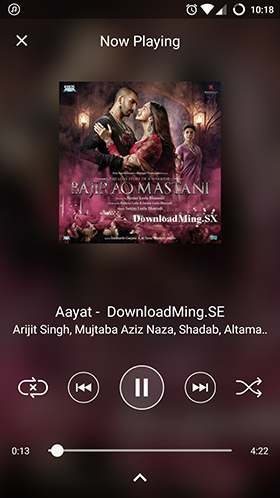
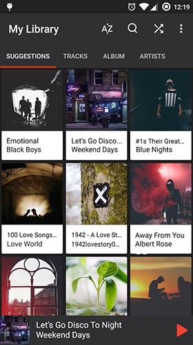
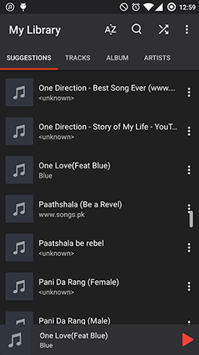
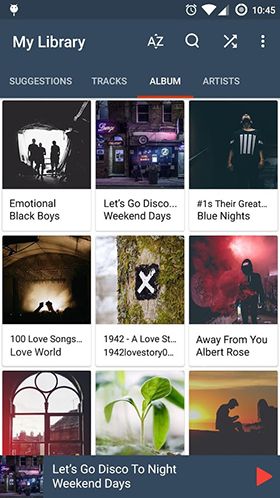
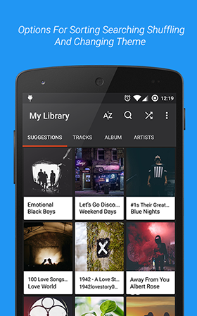

# Rhyme Music Player

Rhyme Music Player is a free, powerful and elegant music player for Android.

This Easy To Use Yet Powerful And Lag Free Music Player Gives You Fantastic Music Experience. It Features Beautiful, Fast And Intuitive Interface And Comes With 2 Beautiful Material Themes. This Player Lets You Manage All Your Music Files Quickly And Easily. It Also Lets You Play Selected Tracks With Reordering Option. It Has All Essential Features Like Music Browsing, Managing Playlists, Shuffle, Repeat And Many More.

# Screenshots

Getting Started
---------------

This sample uses the Gradle build system. To build this project, use the
"gradlew build" command or use "Import Project" in Android Studio.

Developed By
============
Ankur Jain - ankurjainips@gmail.com

Libraries Used
===========================
- Universal Image Loader
- Futuremind RecyclerFastScroll
